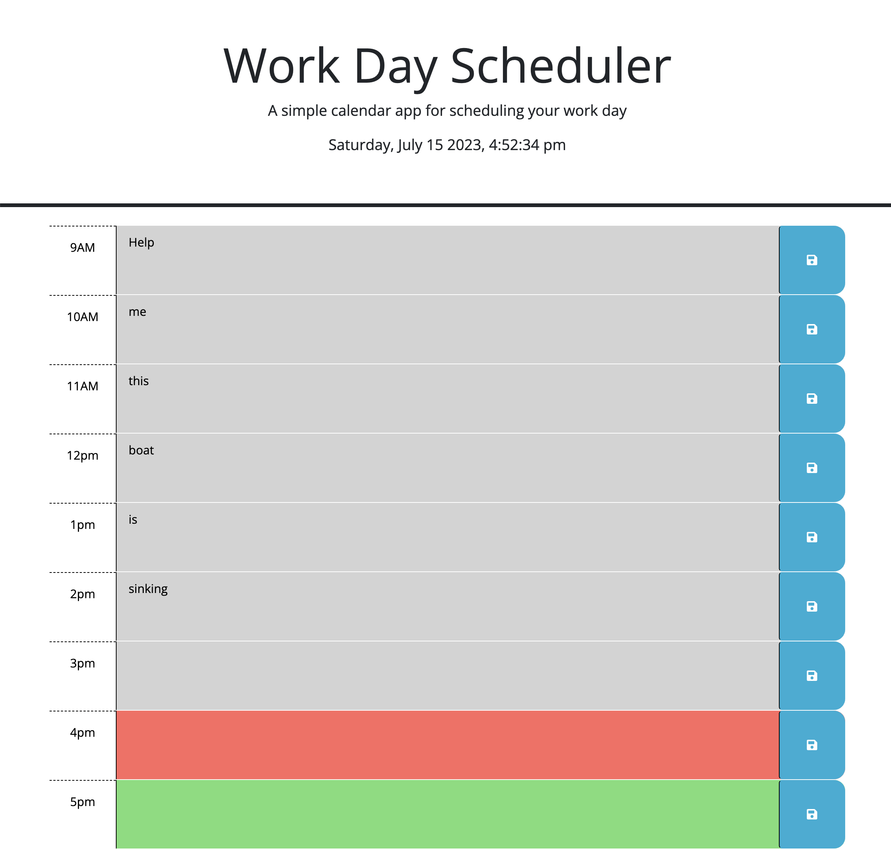

# api-scheduler-05

Quizjs4

Description: This project was to use some starter code to create a planning calendar. Upon the page loading the calender is display the current date and time at the top of the page. An event lister was added to the save buttons next to each hour input box. When clicked the user input for that hour is saved into local storgae. Upon page refresh the stored data is retrieved from local storage and displayed in the appropriate hour text box.

Installation: 

Link to Deployed website: https://drawlin22.github.io/api-scheduler-05/

Usage Deployed Site:

Credits:

Ask BCS help : John Armstrong, Daniel Kang, Sebastian Salvarado

Peer colaboration: Chelsea Wagner

https://github.com/caf62219/calendar-website

Godwin Otabor

https://github.com/Sky6565

License: Please refer to the LICENSE in the repo.